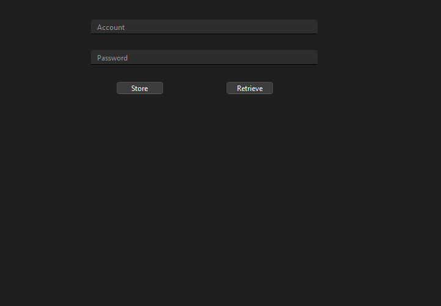
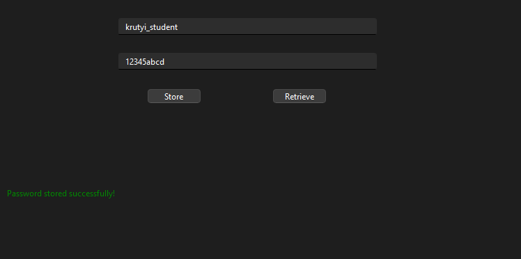
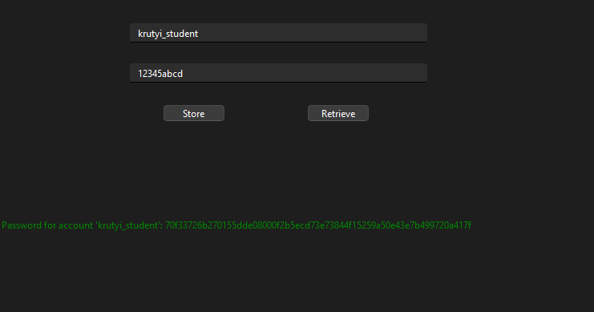
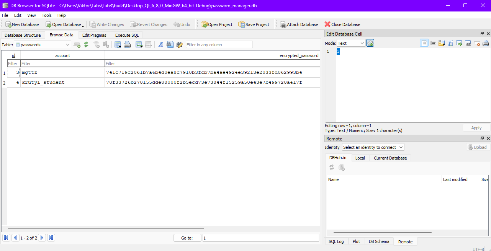

# Лабораторна робота: Менеджер паролів

## Використані бібліотеки/фреймворки

### 1. **SQLite**
- **Бібліотека:** SQLite3 (sqlite-amalgamation).
- **Призначення:** Робота з базою даних для зберігання облікових записів та зашифрованих паролів.
- **Можливості, які використовуються в коді:**
  - **sqlite3_open**: Відкриття бази даних.
  - **sqlite3_exec**: Виконання SQL-запитів для створення таблиць, додавання та отримання даних.
  - **sqlite3_close**: Закриття підключення до бази даних.
  - **sqlite3_errmsg**: Обробка помилок, пов'язаних із запитами.

### 2. **OpenSSL**
- **Бібліотека:** OpenSSL 3.4.0.
- **Призначення:** Шифрування паролів за допомогою криптографічних алгоритмів.
- **Можливості, які використовуються в коді:**
  - **SHA-256 хешування:** Генерація зашифрованих версій паролів для їх безпечного зберігання.
  - Забезпечення криптографічної стійкості даних у базі.

## Короткий опис проєкту

Додаток реалізує менеджер паролів, який дозволяє:
1. Зберігати зашифровані паролі для облікових записів.
2. Отримувати збережені паролі через зручний інтерфейс.

## Інструкції
- SQLite використовується для створення таблиць та керування даними в локальній базі даних.
- OpenSSL забезпечує шифрування паролів перед їх збереженням.

---

## Скріншоти роботи програми

### 1. Головне вікно

### 2. Збереження пароля

### 3. Отримання пароля

### 4. База данних

### Структура проєкту

- **`main.cpp`**: Основний файл програми.
- **`database.h/.cpp`**: Логіка роботи з базою даних SQLite.
- **`crypto.h/.cpp`**: Реалізація шифрування паролів за допомогою OpenSSL.
- **`password_manager.h/.cpp`**: Логіка для збереження та отримання паролів.

---

### Запуск
1. Переконайтесь, що OpenSSL та SQLite налаштовані у вашому середовищі.
2. Використовуйте `CMakeLists.txt` для збірки проєкту.
3. Запустіть програму та працюйте через графічний інтерфейс.

---

### Приклад бази даних
База даних зберігається у файлі `password_manager.db`, створюваному автоматично.
